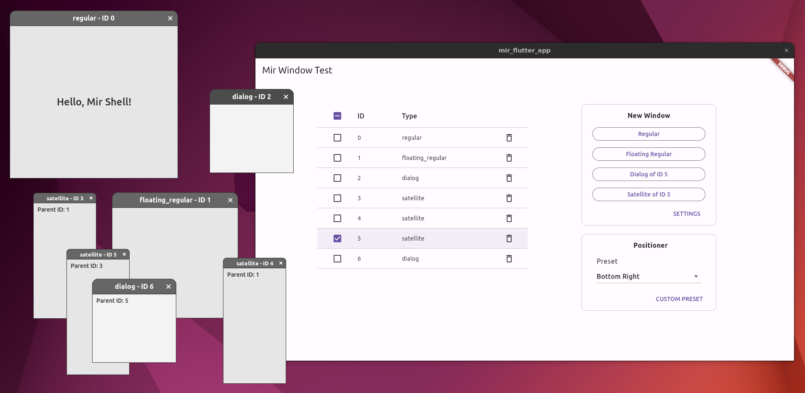
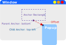

# mir_flutter_app

A prototype application demonstrating desktop multi-window support for Flutter on Linux.



## How To Build

1. Get the source:
    ```sh
    git clone https://github.com/hbatagelo/mir_flutter_app.git
    cd mir_flutter_app
    ```
2. Install the Flutter SDK following the [guide for building Flutter native desktop apps on Linux](https://docs.flutter.dev/get-started/install/linux/desktop).
3. Build with:

    ```sh
    flutter build linux
    ```

## How To Run

The application requires a Wayland compositor with support for the [Mir shell](https://github.com/canonical/mir/blob/main/wayland-protocols/mir-shell-unstable-v1.xml) protocol extension (`mir_shell_unstable_v1`).

In the following, we'll use [Miriway](https://snapcraft.io/miriway), a customizable Wayland compositor that supports Mir shell and provides a default "floating" window manager suitable for demonstrating the different types of desktop windows.

To make sure that Mir shell is supported, install the miriway snap package from the "latest/edge" channel:

```sh
sudo snap install miriway --edge --classic
```

After the installation, open a Virtual Terminal and launch Miriway with the `--add-wayland-extensions mir_shell_v1` command line option:

```sh
miriway --add-wayland-extensions mir_shell_v1
```

In the new graphical shell, press <kbd>Ctrl-Alt-T</kbd> to launch a terminal.

Navigate to the directory containing the source and start the application:

```sh
cd mir_flutter_app
flutter run
```

You'll see the main "mir_flutter_app" window as in the screenshot above.

Use the buttons in the "New Window" panel to create windows of different archetypes supported by the Mir shell.

Select a window list entry to set the window that will become the parent of the next dialog or satellite window. If no entry is selected, dialogs will be created without a parent, and the creation of satellites will be disabled. When a new "regular" or "floating regular" window is created, its entry in the window list is selected automatically.

The following input actions are available for the new windows:

* **Move window**: Left Mouse Button + Drag.
* **Resize window**: Right Mouse Button + Drag.
* **Close window**: Press <kbd>Escape</kbd>, click on the "close button" at the title bar, or on the trashcan icon in the window list.

## Dart API

The prototype introduces the following API for managing the desktop windows from Flutter. See [main.dart](/lib/main.dart) for an example of usage.

### Creating and Destroying Windows

*   #### Creates a regular window:
    ```dart
    Future<int> createRegularWindow(Size size) async
    ```
    Parameters:
    * `size`: Requested window size.

    The return value is a future that returns the ID of the newly created window.

*   #### Creates a floating regular window:
    ```dart
    Future<int> createFloatingRegularWindow(Size size) async
    ```
    Parameters:
    * `size`: Requested window size.

    The return value is a future that returns the ID of the newly created window.

*   #### Creates a dialog window:
    ```dart
    Future<int> createDialogWindow(Size size, int? parent) async
    ```
    Parameters:
    * `size`: Requested window size.

    `parent`: Optional ID of the parent window. If `null`, a parentless dialog is created.

    The return value is a future that returns the ID of the newly created window.

*   #### Creates a satellite window:
    ```dart
    Future<int> createSatelliteWindow(
        int parent,
        Size size,
        Rect anchorRect,
        FlutterViewPositioner positioner) async
    ```
    Parameters:
    * `parent`: ID of the parent window.
    * `size`: Requested window size.
    * `anchorRect`: Anchor rectangle within the parent surface that the child surface will be placed relative to. The rectangle is relative to the window geometry of the parent surface and may not extend outside the window geometry of the parent surface.
    * `positioner`: Positioning preferences. See [Defining a Positioner](#defining-a-positioner).

    The return value is a future that returns the ID of the newly created window.

* #### Closes a window:
    ```dart
    void closeWindow(int windowId)
    ```
    Parameters:
    * `windowId`: ID of the window.

    When the window closes, its ID is invalidated and may be reused by the `create...` functions.

### Querying Window State

These state querying functions are helper functions used by the prototype to display the type of each window in the window list and ensure that a user-defined anchor rectangle stays within the size of the parent surface.

* #### Queries the window type:
    ```dart
    Future<String> getWindowType(int windowId) async
    ```
    Parameters:
    * `windowId`: ID of the window.

    The return value is a future that returns a string describing the window type: "regular", "floating_regular", "dialog", "satellite".

* #### Queries the window size:
    ```dart
    Future<Size> getWindowSize(int windowId) async;
    ```
    Parameters:
    * `windowId`: ID of the window.

    The return value is a future that returns the current window size.

### Defining a Positioner

Positioning preferences are created using the[`FlutterViewPositioner`](/lib/flutter_view_positioner.dart) class. Its attributes specify the rules for the placement of a child window relative to the anchor rectangle of the parent window, as illustrated below:



The attributes are as follows:

* `parentAnchor`: Anchor point for the anchor rectangle. It can be any of the following values of the [`FlutterViewPositionerAnchor`](/lib/flutter_view_positioner.dart) enumeration:
    * `center`: Centered.
    * `top`: Centered at the top edge.
    * `bottom`:  Centered at the bottom edge.
    * `left`: Centered at the left edge.
    * `right`: Centered at the right edge.
    * `topLeft`: Top-left corner.
    * `bottomLeft`: Bottom-left corner.
    * `topRight`: Top-Right corner.
    * `bottomRight`: Bottom-Right corner.

* `childAnchor`: Anchor point for the child window. It can be any value of the [`FlutterViewPositionerAnchor`](/lib/flutter_view_positioner.dart) enumeration.
* `offset`: The [`Offset`](https://api.flutter.dev/flutter/dart-ui/Offset-class.html) from the parent anchor to the child anchor.
* `constraintAdjustment`: A set of [`FlutterViewPositionerConstraintAdjustment`](/lib/flutter_view_positioner.dart) enumeration values defining how the compositor will adjust the position of the window, if the unadjusted position would result in the surface being partly constrained:
    * `slideX`: Adjust the offset along the X axis.
    * `slideY`: Adjust the offset along the Y axis.
    * `flipX`: Reverse the anchor points and offset along the X axis.
    * `flipY`: Reverse the anchor points and offset along the Y axis.
    * `resizeX`: Adjust the size of the child window along the X axis.
    * `resizeY`: Adjust the size of the child window along the Y axis.

    When combined, the adjustments follow a defined precedence: 1) Flip. 2) Slide. 3) Resize.

    Whether the window is considered "constrained" depends on the compositor. For example, the surface may be partly outside the outputs's "work area", thus necessitating the child window's position be adjusted until it is entirely inside the work area.

## How It Works

TODO