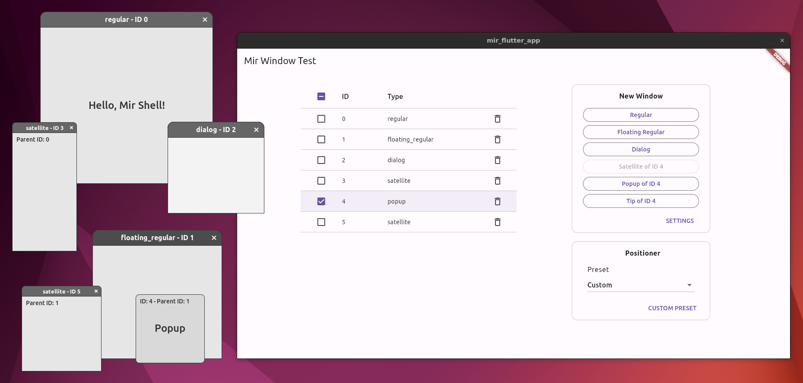

# mir_flutter_app

A prototype application demonstrating desktop multi-window support for Flutter on Linux.



## How To Build

1. Get the source:
    ```sh
    git clone https://github.com/hbatagelo/mir_flutter_app.git
    cd mir_flutter_app
    ```
2. Install the Flutter SDK following the [guide for building Flutter native desktop apps on Linux]((https://docs.flutter.dev/get-started/install/linux/desktop)).
3. Build with:

    ```sh
    flutter build linux
    ```

## How To Run

The application requires a Wayland compositor with support for the [Mir shell](https://github.com/canonical/mir/blob/main/wayland-protocols/mir-shell-unstable-v1.xml) protocol extension (`mir_shell_unstable_v1`).

In the following, we'll use the miral-shell example that comes with [Mir](https://mir-server.io/). Miral-shell supports the required extension and provides a default "floating" window manager that is suitable for demonstrating the different types of desktop windows.

See ['Getting and Using Mir'](https://canonical-mir.readthedocs-hosted.com/stable/getting_and_using_mir/) for instructions on installing Mir.

After installing Mir, open a Virtual Terminal and run:

```sh
miral-app
```

From the new graphical shell, launch a terminal and then run:

```sh
flutter run
```

You'll see the main "mir_flutter_app" window as in the screenshot above.

Use the buttons in the "New Window" panel to create windows of different archetypes supported by the Mir shell.

Select a window list entry to set the window that will become the parent of the next dialog or satellite window. If no entry is selected, dialogs will be created without a parent, and the creation of satellites will be disabled. When a new "regular" or "floating regular" window is created, its entry in the window list is selected automatically.

The following input actions are available for the new windows:

* **Move window**: Left Mouse Button + Drag.
* **Resize window**: Right Mouse Button + Drag.
* **Close window**: Press <kbd>Escape</kbd>, click on the "close button" at the title bar, or on the trashcan icon in the window list.

## Dart API

### Creating and Destroying Windows

*   Creates a **regular** window:
    ```dart
    Future<int> createRegularWindow(Size size) async
    ```
    Parameters:
    * `size`: Requested window size.

    The return value is a future that returns the ID of the newly created window.

*   Creates a **floating regular** window:
    ```dart
    Future<int> createFloatingRegularWindow(Size size) async
    ```
    Parameters:
    * `size`: Requested window size.

    The return value is a future that returns the ID of the newly created window.

*   Creates a **dialog** window:
    ```dart
    Future<int> createDialogWindow(Size size, int? parent) async
    ```
    Parameters:
    * `size`: Requested window size.

    `parent`: Optional ID of the parent window. If `null`, a parentless dialog is created.

    The return value is a future that returns the ID of the newly created window.

*   Creates a **satellite** window:
    ```dart
    Future<int> createSatelliteWindow(
        int parent,
        Size size,
        Rect anchorRect,
        FlutterViewPositioner positioner) async
    ```
    Parameters:
    * `parent`: ID of the parent window.
    * `size`: Requested window size.
    * `anchorRect`: Anchor rectangle within the parent surface that the child surface will be placed relative to. The rectangle is relative to the window geometry of the parent surface and may not extend outside the window geometry of the parent surface.
    * `positioner`: Positioning preferences. See [Defining a Positioner](#defining-a-positioner).

    The return value is a future that returns the ID of the newly created window.

* Closes a window:
    ```dart
    void closeWindow(int windowId)
    ```
    Parameters:
    * `windowId`: ID of the window.

    When the window closes, its ID is invalidated and may be reused by the `create...` functions.

### Querying Window State

These state querying functions are helper functions used by the prototype application to display the type of each window in the window list and ensure that a user-defined anchor rectangle stays within the size of the parent surface.

*   Queries the window type:
    ```dart
    Future<String> getWindowType(int windowId) async
    ```
    Parameters:
    * `windowId`: ID of the window.

    The return value is a future that returns a string describing the window type: "regular", "floating_regular", "dialog", "satellite".

*   Queries the window size:
    ```dart
    Future<Size> getWindowSize(int windowId) async;
    ```
    Parameters:
    * `windowId`: ID of the window.

    The return value is a future that returns the current window size.

### Defining a Positioner

TODO

## How It Works

TODO